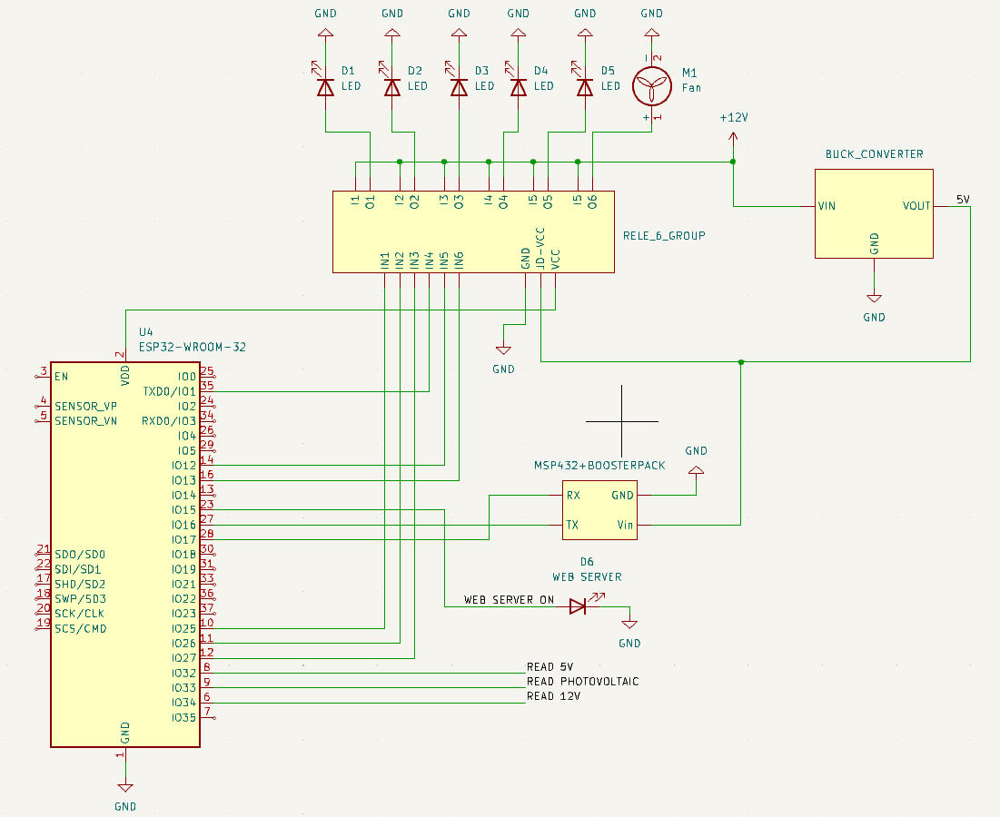
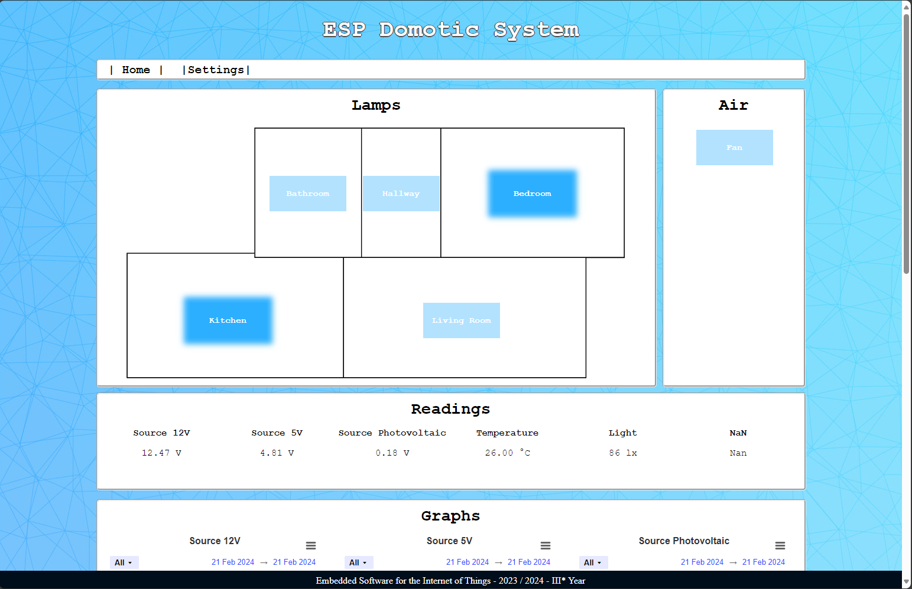
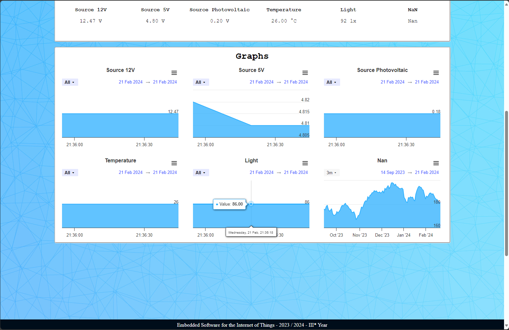

# ESP DOMOTIC SYSTEM
ESP Domotic System is a simple domotic system to control sensors and domotic items of a small house. It is associated to a web app that allows to check real-time graphs of power consumption and sensor readings. The web app also allows to turn on and off domotic items such as lights or fans. This project exploits the concept of embedded systems to simplify control of a small house. It also offers the possibility to give several voice commands through a voice model, for example to turn on or off lights.
### Schematic

 <p>

</p>

 ## Requirements 

 ### Hardware requirements
 ESP Domotyc System requires:
 * Texas Instruments MSP432P401R with BoosterPack
 * 2 x ESP32
 * Relay module
 * Matrix Board
 * Buck converter and resistance
 * INMP441 microphone
 * 5 x LED stripes 12V
 * 12V power supply
 * Solar panel
 * 12V fan

### Software requirements
You will need [Code Composer Studio](https://www.ti.com/tool/CCSTUDIO) installed with [DriverLib](https://www.ti.com/tool/MSPDRIVERLIB) to compile and run the code on the MSP. You will also need [Arduino IDE 2.x](https://www.arduino.cc/en/software) to run the ESPs. 

## Project Layout

```

├── esp_main                
│   ├── esp_main_code        # main code to be run on the main esp
│   ├── esp_main_data        # data of the web server held on the esp
├── ESP_SpeechToText         # main code to be run on the voice module esp
├── ServerGoogleAPI          # connection to google server
├── msp432                   # project to be imported in CodeComposerStudio
├── house_model              # 3D model to print house model anb brackets for components
```

## Build and Run the project

After connecting the devices as indicated in the [schematic](#schematic), you have to upload programs on each board.
Starting from the MSP432:
1. Open CodeComposerStudio
2. Go to **File** > **Open Projects from File Systems**
3. In **Import Projects from File Systems** search and select the project.

To add the DriverLib:
1. Go to **Build** > **Arm Linker** > **File Search Path** and add the paths where you installed the library

Once you have done that you can right-click on the main project folder and click on **Build Project**, once ended you can click **Flash** on CCS to upload the code on the MSP432.


For the main ESP: 
1. Open Arduino IDE 2.x
2. Select the board "ESP32 dev module"
3. Go to **File** > **Open** and select the .ino file


For the second ESP: 
1. Open Arduino IDE2.x
2. Select the board "ESP32 dev module"
3. Go to **File** > **Open** and select the .ino file

> Be sure that the GoogleServerAPI directory is in the same directory as the project and don't rename any file

## User Guide 
 After the connections are ready and the boards are powered, wait that the blue led on the main ESP turn on. This means that the server is ready and you can proceed accessing the web app.
 To do so, open the Arduino console and read the main ESP IP address, copy it into your browser (pay attention to be connected at the same WiFi of the board) and this page will show up:
 <p align = "center"> </p>

 You can use those buttons to turn on/off lights and fan. When the blue is bright it means the power is on, otherwise it's off. Scrolling down you will see the graphs, that monitors all the sensors and power supplies of the sistem.

 <p align = "center">  </p>

 You can also use a various set of voice command, composed in this way:
 * If you want to turn or/off lights the command is "_ROOM_ + LIGHTS + ON/OFF"
 * If you want to turn or/off the fan the command is "FAN + ON/OFF"

> Available rooms: LIVING ROOM, KITCHEN, BATHROOM, BEDROOM, HALLWAY.

Just click the button and say the desired command. The command will execute in a few seconds

## Contributors

<table>
    <tr>
        <td>House model and cabling</td>
        <td>Emilian Manole</td>
    </tr>
    <tr>
        <td>Web app and Async server</td>
        <td>Emilian Manole</td>
    </tr>
    <tr>
        <td>MSP432</td>
        <td>Leonardo Rigotti</td>
    </tr>
    <tr>
        <td>UART communication</td>
        <td>Leonardo Rigotti</td>
    </tr>
    <tr>
        <td>First ESP</td>
        <td>Emilian Manole, Leonardo Rigotti</td>
    </tr>
    <tr>
        <td>Second ESP</td>
        <td>Elia Avanzolini, Riccardo Randon</td>
    </tr>
    <tr>
        <td>Voice Module</td>
        <td>Elia Avanzolini, Riccardo Randon</td>
    </tr>
</table>

